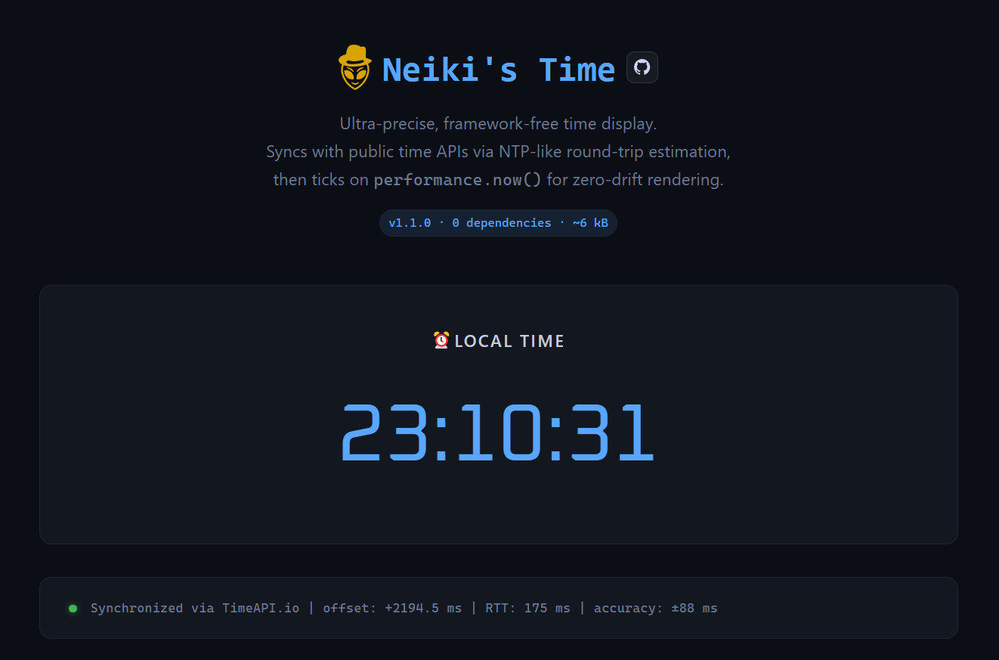

<p align="center">
  
</p>

<h1 align="center">Neiki's Time</h1>

<p align="center">
  
  <br>
  
  
</p>

<p align="center">
  <b>Ultra-Precise Time Display</b><br>
  <i>NTP-synced, drift-free, framework-free — just one script tag.</i>
</p>

<p align="center">
  
  
  
  
</p>

---



---

**Live demo:** [https://neiki.eu/time](https://neiki.eu/time)

---

## ⚡ Quick Start (CDN)

Add two lines to any HTML page — no build tools, no frameworks, no dependencies:

```html
<div data-neiki-time></div>
<script src="https://cdn.neiki.eu/neiki-time/neiki-time.min.js"></script>
```

That's it. The clock syncs automatically and starts ticking.

> Unminified version also available at `https://cdn.neiki.eu/neiki-time/neiki-time.js`

---

## 🔧 Configuration

```js
NeikiTime.init({
  selector: '[data-neiki-time]',  // CSS selector for clock elements
  timezone: 'Europe/Prague',       // IANA timezone (undefined = local)
  locale: 'cs-CZ',                // Intl locale
  showDate: true,                  // show date part
  showMs: true,                    // show milliseconds
  showOffset: false,               // show sync debug info
  syncInterval: 60000,             // re-sync interval in ms
  syncSamples: 3,                  // samples per API per sync round
  theme: 'auto',                   // 'light' | 'dark' | 'auto' | 'none'
  onSync: function(info) {},       // callback after successful sync
  onTick: function(date) {}        // callback every animation frame
});
```

---

## 📌 Data Attributes

Per-element overrides via HTML attributes:

| Attribute | Description |
|---|---|
| `data-neiki-time` | Marks element as a clock (required) |
| `data-neiki-tz="Asia/Tokyo"` | Override timezone for this element |
| `data-neiki-nodate` | Hide the date part |
| `data-neiki-noms` | Hide milliseconds |
| `data-neiki-offset` | Show sync offset & RTT debug info |

---

## 📡 JavaScript API

| Method | Returns | Description |
|---|---|---|
| `NeikiTime.init(options?)` | — | Initialize and start rendering |
| `NeikiTime.destroy()` | — | Stop everything, release resources |
| `NeikiTime.sync()` | `Promise` | Trigger manual re-sync |
| `NeikiTime.now()` | `number` | Precise UTC timestamp in ms |
| `NeikiTime.date()` | `Date` | Precise Date object |
| `NeikiTime.isSynced()` | `boolean` | Whether time has been synced |
| `NeikiTime.getSyncInfo()` | `object\|null` | Last sync info (offset, rtt, api) |

---

## 🧠 How It Works

1. Parallel queries to multiple public time APIs (WorldTimeAPI, TimeAPI.io)
2. Multiple samples per API — selects the one with the lowest round-trip time
3. NTP-style offset: `offset = serverTime − (t0 + rtt/2)`
4. Anchors to `performance.now()` for monotonic, drift-free ticking
5. `requestAnimationFrame()` for smooth ~60 fps rendering
6. Periodic re-sync (default every 60 s) to correct any residual drift

**Typical accuracy:** ±15–80 ms depending on network latency. Between syncs, `performance.now()` guarantees zero drift.

---

## 📄 License

This project is licensed under the **MIT License** — see the [LICENSE](LICENSE) file for details.

---

## 👨‍💻 Author

**neikiri**
GitHub: https://github.com/neikiri

---

## 📬 Contact

📧 Email: dev@neiki.eu
